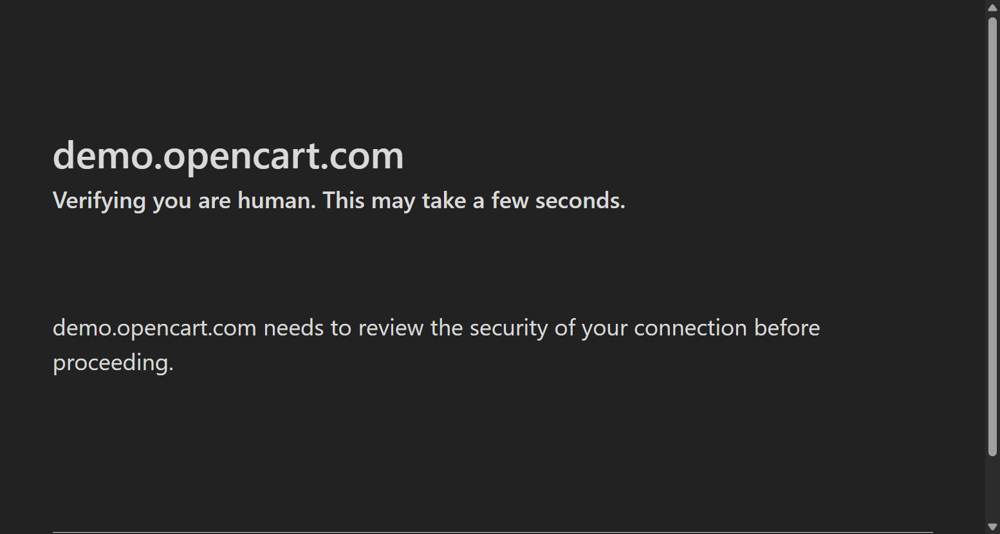

# 🧪 Robot Framework UI Test Automation – SauceDemo

This project is a complete **end-to-end UI test automation suite** for [SauceDemo](https://www.saucedemo.com), built using **Robot Framework** and **SeleniumLibrary**.

It demonstrates real-world browser automation skills including form submission, error handling, and visual validation — ideal for showcasing to employers.

---

## 📁 Project Structure

ui-testing/
ecommerce-testing/
├── tests/
│ ├── test_add_to_cart_saucedemo.robot
│ ├── test_checkout_flow_saucedemo.robot
│ ├── test_login_negative.robot
│ ├── test_login_positive.robot
│ ├── test_open_website.robot
│ └── test_search_functionality.robot
├── resources/ # Shared keywords/variables 
├── output/ # Auto-generated reports and screenshots (gitignored)
├── selenium-screenshots
├── requirements.txt
├── .gitignore
└── README.md


---

## ✅ Features Covered

- ✅ Launch website and validate title
- ✅ Login with standard user
- ✅ Login with blocked user (error handling)
- ✅ Login with `problem_user` (UI glitch detection)
- ✅ Add product to cart
- ✅ Complete checkout flow
- ✅ Screenshot capture on failure

---

## 🛠 Technologies Used

| Tool              | Purpose                         |
|------------------|----------------------------------|
| Robot Framework  | Test automation engine           |
| SeleniumLibrary  | UI testing library               |
| ChromeDriver     | Controls Chrome browser          |
| Python (venv)    | Virtual environment              |
| VS Code          | Development editor               |

---

## ⚙️ Setup Instructions

### 1. Clone the project & activate environment
```bash
git clone https://github.com/<your-username>/your-repo.git
cd ui-testing/ecommerce-testing

2. Install dependencies
 pip install -r requirements.txt

3. Run all tests
   robot tests/

4. View results
   log.html – full execution log
   report.html – test summary
   📸 Screenshots on failure: saved in output/

📸 Example Failure Screenshot


🙋‍♂️ Use Case
This project can be used to:
   Demonstrate your UI automation skills to recruiters
   Practice writing modular Robot Framework tests
   Extend into page object–style frameworks in future

⭐ Star this repo if you find it helpful!

